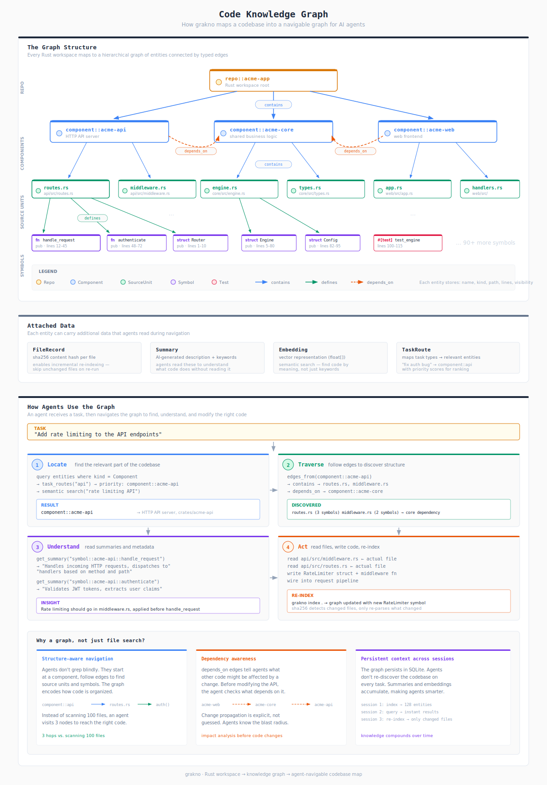

# Chizu (地図)

**Your code's mental map.**

Chizu is a local-first code knowledge graph for software repositories. It builds a
structured model of your codebase: symbols, files, components, and their relationships.
It helps you navigate large codebases by understanding structure, not just text.

The CLI surface is a flat 9-command interface: `index`, `search`, `entity`,
`entities`, `routes`, `edges`, `visualize`, `config`, and `guide`.



## Quick Start

### Installation

```bash
cargo install --path crates/chizu
```

Or from crates.io (when published):
```bash
cargo install chizu
```

### 1. Configure and Index Your Repository

```bash
chizu --repo /path/to/repo config init
chizu --repo /path/to/repo index
```

This creates a `.chizu/graph.db` file in your repository with:
- Entities (symbols, files, components, docs)
- Edges (relationships like "defines", "uses", "imports")
- Summaries and embeddings for query-time retrieval

Requires configured LLM and embedding providers (for example, Ollama) to be running.

### 2. Search and Inspect the Graph

```bash
# Generate a reading plan for a task
chizu --repo /path/to/repo search "how does authentication work"

# List entities
chizu --repo /path/to/repo entities

# Inspect a specific entity
chizu --repo /path/to/repo entity "component::cargo::crates/my-crate"
```

### 3. Visualize

```bash
# Generate an SVG graph
chizu --repo /path/to/repo visualize --legend > graph.svg

# Open in browser
open graph.svg
```

## Commands Reference

| Command | Description | Example |
|---------|-------------|---------|
| `index` | Parse graph + summarize + embed | `chizu --repo . index` |
| `search` | Full query pipeline -> reading plan | `chizu --repo . search "fix auth bug"` |
| `entity` | Show a single entity in detail | `chizu --repo . entity <entity-id>` |
| `entities` | List entities in graph | `chizu --repo . entities --component X` |
| `routes` | Show task routes | `chizu --repo . routes --task deploy` |
| `edges` | Show relationships | `chizu --repo . edges --from <id>` |
| `visualize` | Generate SVG graph | `chizu --repo . visualize > graph.svg` |
| `config` | Create or validate config | `chizu --repo . config init` |
| `guide` | Show interactive guide | `chizu guide` |

## Search and Lookup

**Use `search`** when you have a task:
- "how do I add a new API endpoint"
- "debug the authentication flow"
- "refactor the database layer"

Search combines task classification, keyword/name/path matching, graph expansion,
and vector retrieval into one reading-plan pipeline.

**Use `entity`, `entities`, `routes`, and `edges`** when you already know what
you want to inspect:
- `entity <id>` for one detailed record
- `entities` to browse the graph
- `routes` to inspect task routing
- `edges` to inspect relationships directly

## Configuration

Create a `.chizu.toml` config file:

```bash
chizu --repo /path/to/repo config init
```

Example configuration:

```toml
[index]
exclude_patterns = ["**/target/**", "**/.git/**", "**/node_modules/**"]
parallel_workers = 4

[query]
default_limit = 15

[llm]
base_url = "http://localhost:11434/v1"
api_key = ""
default_model = "llama3.2-vision:latest"
timeout_secs = 120

[embedding]
enabled = true # required
provider = "ollama"
base_url = "http://localhost:11434/v1"
model = "nomic-embed-text-v2-moe:latest"
dimensions = 768
batch_size = 32
```

## Architecture

Chizu uses a **dual-backend storage system**:

### SQLite + usearch (default)
- **SQLite**: Stores entities, edges, files, summaries, and task routes
- **usearch**: HNSW vector index for fast similarity search over embeddings
- Local, fast, no external dependencies

### Grafeo (alternative)
- Unified graph database backend
- Handles both structured data and vector search in one system

## Entity Types

| Type | Description | Example |
|------|-------------|---------|
| `symbol` | Functions, structs, traits | `fn handle_request` |
| `source_unit` | Source files | `src/main.rs` |
| `component` | Crate/package | `component::cargo::crates/chizu-core` |
| `doc` | Markdown documentation | `README.md` |
| `test` | Test functions | `#[test] fn test_routing` |
| `containerized` | Dockerfiles | `Dockerfile` |
| `infra_root` | Terraform directories | `infra/prod` |

## Component IDs

Components use canonical path-based IDs:
- `component::cargo::crates/chizu-core` (Rust crate)
- `component::npm::packages/web` (npm package)
- `component::npm::.` (root package)

This ensures consistency even when package names change.

## Daily Workflow

```bash
# 1. Start a new task - get oriented
chizu --repo . search "implement user profiles"

# 2. Inspect the most relevant entities
chizu --repo . entity "symbol::src/auth.rs::verify_token"

# 3. Inspect graph relationships directly
chizu --repo . edges --from "symbol::src/auth.rs::verify_token"

# 4. Find similar implementations
chizu --repo . search "session management"

# 5. Visualize the architecture
chizu --repo . visualize --legend > arch.svg
```

## Requirements

- **Rust** 1.70+ (to build)
- **Ollama** or another configured OpenAI-compatible provider
  (required for indexing summaries/embeddings and for search)
  - Install: https://ollama.com
  - Pull models: `ollama pull nomic-embed-text-v2-moe:latest`

## Documentation

- [Product PRD](docs/prd.md)
- [Brief](docs/brief.md)
- Interactive guide: `chizu guide`

## License

MIT
